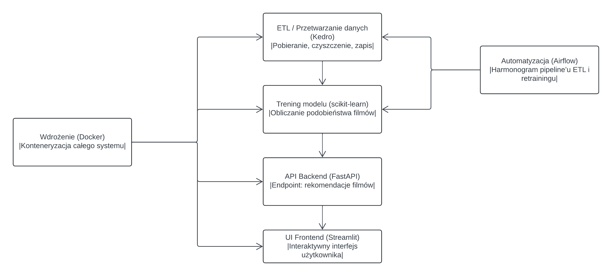

<h1 align="center">🎬 Content-Based Movie Recommender System</h1>

Rekomendacja filmów na podstawie tytułu filmu obejrzanego przez użytkownika

---

## 🧩 Wybór tematu projektu

**Problem do rozwiązania:**  
Rekomendacja filmów na podstawie tytułu filmu obejrzanego przez użytkownika (**Content-Based Recommender System**).

**Wartość użytkowa:**  
System ułatwia użytkownikom odkrywanie filmów podobnych do tych, które już lubią.  
Może stanowić bazę dla systemów rekomendacji w serwisach streamingowych (np. Netflix, HBO Max, Disney+).

**Zbiór danych:**  
📂 [TMDB 5000 Movie Dataset (Kaggle)](https://www.kaggle.com/datasets/tmdb/tmdb-movie-metadata)  
Pliki:  
- `tmdb_5000_movies.csv`  
- `tmdb_5000_credits.csv`

---

## 🏗️ Architektura systemu

| 🧱 Moduł                      | 📝 Opis                                         | ⚙️ Technologia  |
| ----------------------------- | ---------------------------------------------- | ---------------- |
| ETL / przetwarzanie danych    | Czyszczenie i przygotowanie danych filmowych   | Kedro            | 
| Trening modelu                | Obliczanie podobieństwa między filmami         | scikit-learn     |
| API backend                   | Udostępnienie rekomendacji                     | FastAPI          |
| UI frontend                   | Interaktywny interfejs użytkownika             | Streamlit        |
| Automatyzacja                 | Uruchamianie pipeline’u ETL i retrainingu      | Airflow          |
| Wdrożenie                     | Konteneryzacja i deployment                    | Docker           |

---

## 🧮 Diagram architektury

---

## 👥 Członkowie zespołu

| Imię i nazwisko | Rola w projekcie | GitHub login |
| ---------------- | ---------------- | ------------- |
| **Michał Czycza** | Właściciel projektu | [@Mickelele](https://github.com/Mickelele) |

---

## 🧭 Linki projektu

📦 **Repozytorium GitHub:**  https://github.com/PJATK-ASI-2024/ai_project_Michal_Czycza
🗂️ **GitHub Project Board:** https://github.com/orgs/PJATK-ASI-2024/projects/191/views/1
📜 **Diagram architektury:** [docs/architecture_diagram.png](docs/diagram_architektury.png)

---

## 🚀 Status projektu

📅 *Etap:* projekt architektury  
🔧 *Kolejny krok:* implementacja pipeline’u ETL w Kedro  

---

## 📜 Licencja

Projekt open-source, dostępny na zasadach licencji MIT.

