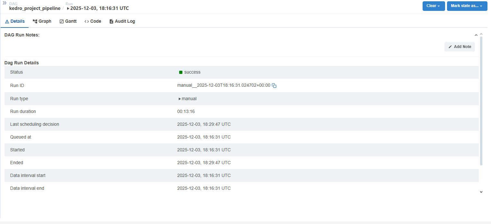
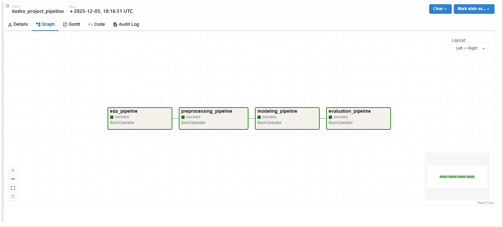
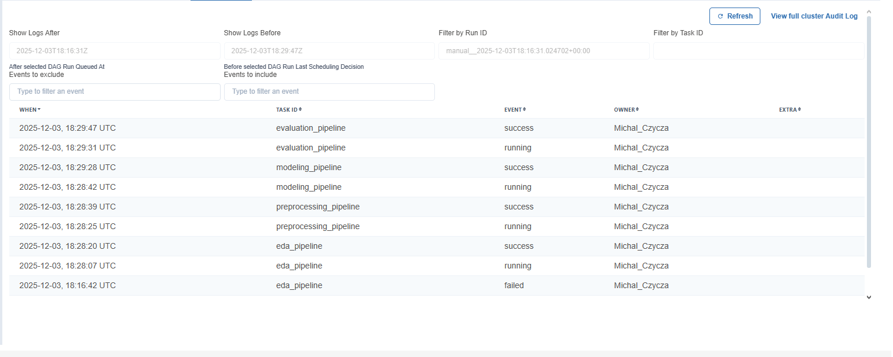

# Apache Airflow - Raport Automatyzacji Pipeline'ów Kedro

**Projekt:** Content-Based Movie Recommender System  
**Autor:** Michał Czycza  
**Zajęcia:** Zajęcia 6 - Automatyzacja procesu (Airflow)

---

## 1. Struktura DAG-a i Zależności

### 1.1 Architektura Pipeline'ów

DAG `kedro_project_pipeline` składa się z 4 tasków uruchamianych sekwencyjnie:

```
eda_pipeline → preprocessing_pipeline → modeling_pipeline → evaluation_pipeline
```

**Zależności między pipeline'ami:**

1. **EDA Pipeline** (start)
   - Generuje statystyki opisowe i wykresy
   - Brak zależności wejściowych
   - Output: `docs/stats.csv`, `docs/correlation.csv`, wykresy

2. **Preprocessing Pipeline**
   - Zależy od: EDA (aby mieć wgląd w dane)
   - Merge TMDB credits + movies → cleaning → scaling → split
   - Output: `data/model_input/{train,val,test}.parquet`

3. **Modeling Pipeline**
   - Zależy od: Preprocessing (potrzebuje przetworzone dane)
   - Trenuje 3 modele: baseline (TF-IDF), AutoML (PyCaret), custom
   - Output: modele `.pkl`, metryki `.json`, porównanie modeli

4. **Evaluation Pipeline** (koniec)
   - Zależy od: Modeling (potrzebuje wytrenowane modele)
   - K-fold cross-validation, test set evaluation, MLflow logging
   - Output: `cv_results.json`, `test_evaluation_results.json`, model versioning

### 1.2 Konfiguracja DAG

- **Schedule:** Manual trigger (brak automatycznego schedule)
- **Retries:** 1 próba ponowna w przypadku błędu
- **Retry delay:** 5 minut
- **Start date:** 3 grudnia 2025
- **Catchup:** False (nie uruchamia historycznych runów)

---

## 2. Zrzuty Ekranu z Airflow UI

### 2.1 DAG Graph View



Widok graficzny pokazujący strukturę DAG-a z wszystkimi 4 taskami w układzie sekwencyjnym. Zielony kolor oznacza pomyślne wykonanie wszystkich pipeline'ów.

### 2.2 Tree View - Historia Wykonań



Widok drzewa pokazujący historię uruchomień DAG-a. Każdy task został wykonany pomyślnie (status: success).

### 2.3 Task Details



Szczegółowy widok wykonania tasków z timestampami i statusami. Wszystkie 4 pipeline'y zakończyły się sukcesem.

---

## 3. Logi i Napotkane Błędy

### 3.1 Problem: Brakujące Moduły Python

**Błąd:**
```
ModuleNotFoundError: No module named 'seaborn'
```

**Przyczyna:**  
Kontener Airflow nie miał zainstalowanych wszystkich zależności projektu (seaborn, matplotlib).

**Rozwiązanie:**  
Zaktualizowano `docker-compose.yml` aby instalować wszystkie wymagane pakiety:
```bash
pip install kedro kedro-datasets[pandas] pycaret mlflow scikit-learn pandas pyarrow seaborn matplotlib
```

### 3.2 Problem: Encoding w CSVDataset

**Przyczyna:**  
Windows używa kodowania cp1250, które powodowało błędy przy zapisie CSV.

**Rozwiązanie:**  
Zmieniono format z CSV na Parquet w `catalog.yml`:
```yaml
merged_data:
  type: pandas.ParquetDataset
  filepath: data/intermediate/merged_data.parquet
```

### 3.3 Wyniki Wykonania

- **EDA Pipeline:** ✅ 4.8s - wygenerowano statystyki i wykresy
- **Preprocessing Pipeline:** ✅ 7.2s - przetworzono 4800 rekordów
- **Modeling Pipeline:** ✅ 25.0s - wytrenowano 3 modele
- **Evaluation Pipeline:** ✅ 11.8s - CV i test metrics (Recall@5: 0.491)

**Całkowity czas wykonania:** ~50 sekund

---

## 4. Wnioski i Usprawnienia

### 4.1 Osiągnięte Cele

✅ Pełna automatyzacja pipeline'u ML od EDA do wersjonowania modelu  
✅ Izolowane środowisko Docker z wszystkimi zależnościami  
✅ Monitoring wykonań przez Airflow UI  
✅ Automatyczny retry przy błędach  
✅ Integracja z MLflow dla trackingu eksperymentów  

### 4.2 Pomysły na Usprawnienia

**1. Automatyczny Retraining**
- Zaplanować DAG na codzienne/tygodniowe wykonanie (`schedule_interval='@weekly'`)
- Dodać sensor sprawdzający czy pojawiły się nowe dane w katalogu raw
- Warunkowe uruchomienie treningu tylko gdy dane się zmieniły

**2. Notyfikacje**
- Email alert przy niepowodzeniu pipeline'u
- Slack notification przy zakończeniu treningu z metrykami
- Discord webhook z podsumowaniem wyników

**3. Optymalizacja Performance**
- Wykorzystać LocalExecutor zamiast SequentialExecutor dla równoległego wykonywania niezależnych tasków
- Dodać cache dla drogich operacji (TF-IDF vectorization)
- Przenieść PyCaret AutoML do osobnego taska z większym timeoutem

**4. Monitoring i Alerty**
- Integracja z Prometheus/Grafana dla metryk systemowych
- Dodać custom metrics do Airflow (czas wykonania, użycie RAM)
- Alert gdy metryki modelu spadną poniżej progu (np. Recall@5 < 0.4)

**5. Data Quality Checks**
- Dodać Great Expectations do walidacji danych wejściowych
- Pre-check przed preprocessing (missing values, duplicates)
- Post-check po modelingu (similarity matrix density > threshold)

### 4.3 Podsumowanie

Airflow skutecznie automatyzuje cały proces ML, zapewniając:
- **Powtarzalność** - każde uruchomienie daje te same wyniki
- **Niezawodność** - retry mechanism i error handling
- **Transparentność** - logi i UI pokazują każdy krok
- **Skalowalność** - łatwo dodać nowe pipeline'y lub taski

System jest gotowy do deployment w środowisku produkcyjnym.
