# Eksploracja Danych (EDA) — Projekt Filmowy TMDB

**Autor:** Michał Czycza  
**Data:** 2025-11-05

---

## Cel analizy

Celem eksploracji danych było zrozumienie zawartości dwóch zbiorów danych:

- `tmdb_5000_movies.csv` — informacje o filmach (np. tytuł, budżet, gatunek, popularność, przychody).  
- `tmdb_5000_credits.csv` — informacje o obsadzie i ekipie filmowej.  

Analiza miała na celu ocenę jakości danych, identyfikację braków, wartości odstających i potencjalnych problemów, które należy uwzględnić przed dalszym przetwarzaniem (np. czyszczeniem i modelowaniem).

---

## Opis danych

| Zmienna        | Opis                           | Przykład                         |
| -------------- | ------------------------------ | -------------------------------- |
| `budget`       | Budżet filmu w USD             | 150000000                        |
| `genres`       | Lista gatunków w formacie JSON | `[{"id": 28, "name": "Action"}]` |
| `homepage`     | Oficjalna strona filmu         | `http://www.avatar.com/`         |
| `popularity`   | Wskaźnik popularności TMDB     | 150.4376                         |
| `release_date` | Data premiery                  | 2009-12-10                        |
| `revenue`      | Przychód filmu w USD           | 2787965087                        |
| `runtime`      | Czas trwania filmu (min)       | 162                                |
| `vote_average` | Średnia ocena użytkowników     | 7.2                                |
| `vote_count`   | Liczba głosów                  | 11800                              |

---

## Zbiór: `tmdb_5000_credits.csv`

Zawiera dane o obsadzie i ekipie technicznej filmu. Najważniejsze kolumny:

- `cast` – lista aktorów z przypisaną rolą  
- `crew` – lista członków zespołu (reżyser, scenarzysta, itd.)  

---

## Główne obserwacje

1. **Braki danych:**
   - Występują w kolumnach: `homepage`, `tagline`, `keywords`, `production_companies`.  
   - Są to dane opisowe – część braków jest naturalna.  

2. **Duplikaty:**
   - Brak duplikatów po kolumnie `title`.  
   - Identyfikator `id` jest unikalny.  

3. **Wartości odstające:**
   - Kolumny `budget` i `revenue` zawierają silne wartości odstające (blockbustery typu *Avatar*, *Titanic*).  
   - Można rozważyć transformację logarytmiczną (np. `log1p`) w dalszych analizach.  

4. **Problemy jakości danych:**
   - Kolumny JSON (`genres`, `production_companies`, `cast`, `crew`) wymagają parsowania.  
   - Niekiedy wartości w `budget` lub `revenue` wynoszą 0, co prawdopodobnie oznacza brak danych, a nie rzeczywiste zero.  
   - Kolumna `release_date` powinna być konwertowana do typu `datetime`.  

---

## Diagramy

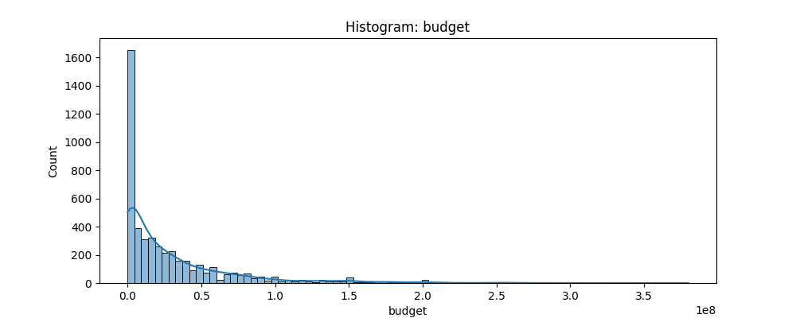  
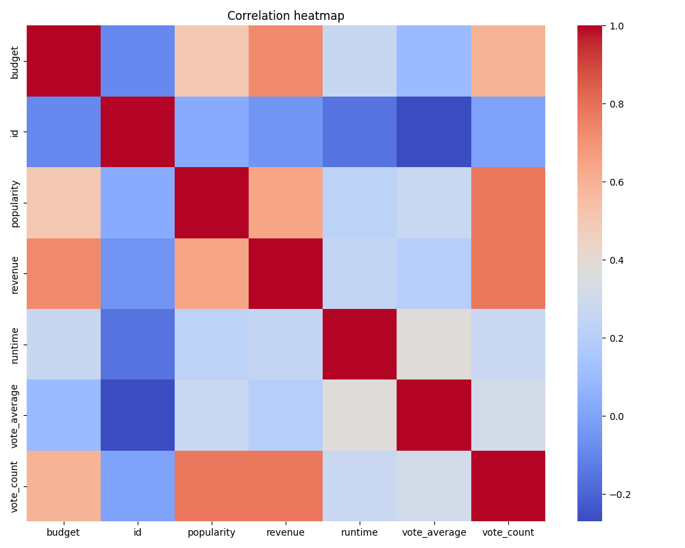  
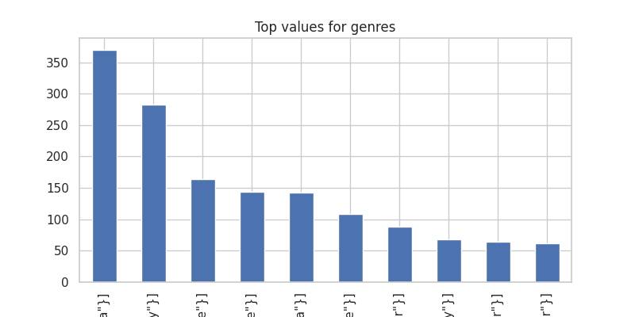  
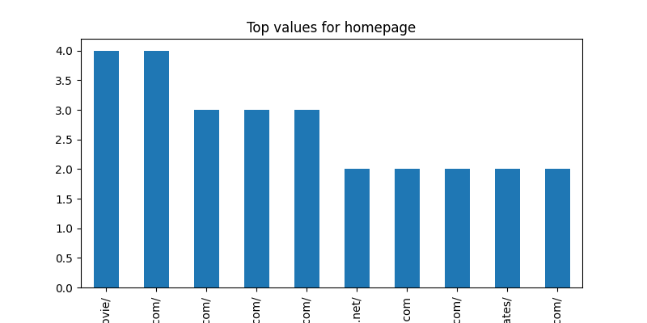 
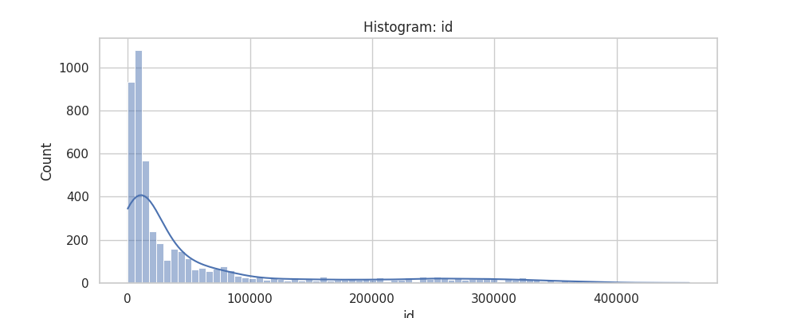 
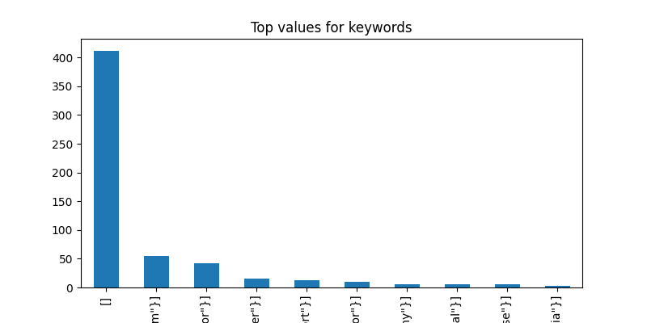 
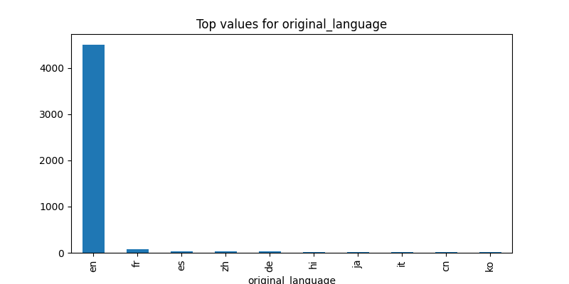 
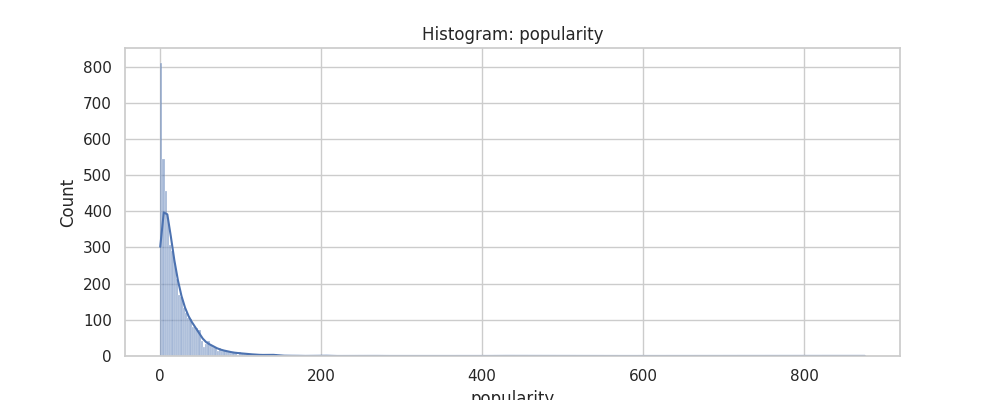 
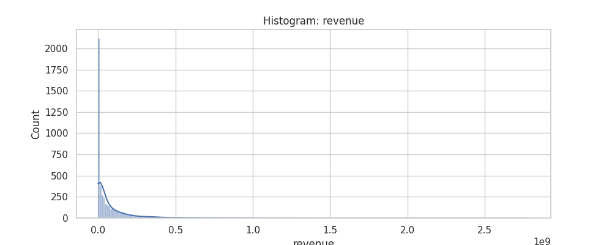 
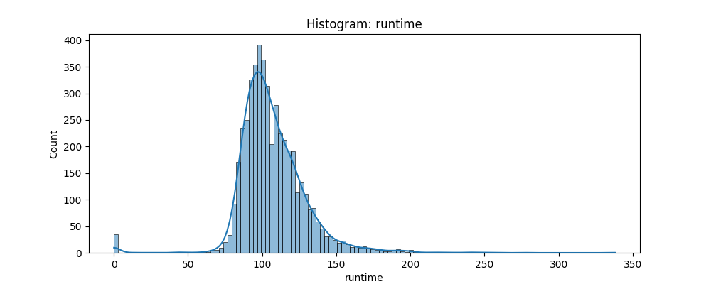 
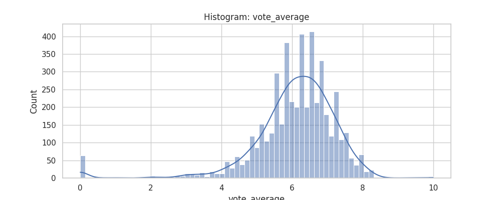 

> Możesz wstawić własne wykresy, np. zapisane z Pythona w folderze `images/`.

---

## Propozycje dalszych kroków

### 1. Czyszczenie danych
- Usunięcie nieużywanych kolumn (`homepage`, `tagline`).  
- Zamiana wartości 0 na `NaN` w `budget` i `revenue`.  
- Konwersja `release_date` na typ daty.  

### 2. Standaryzacja
- Przeskalować zmienne o dużej rozpiętości (`budget`, `revenue`).  
- Ujednolicić format tekstowy (`genres`, `production_companies` → listy nazw).  

### 3. Feature engineering
- Wyodrębnić rok premiery z `release_date`.  
- Policz średnie przychody dla gatunków lub reżyserów.  
- Stworzyć wskaźnik opłacalności filmu:  
  ```text
  profit = revenue - budget
