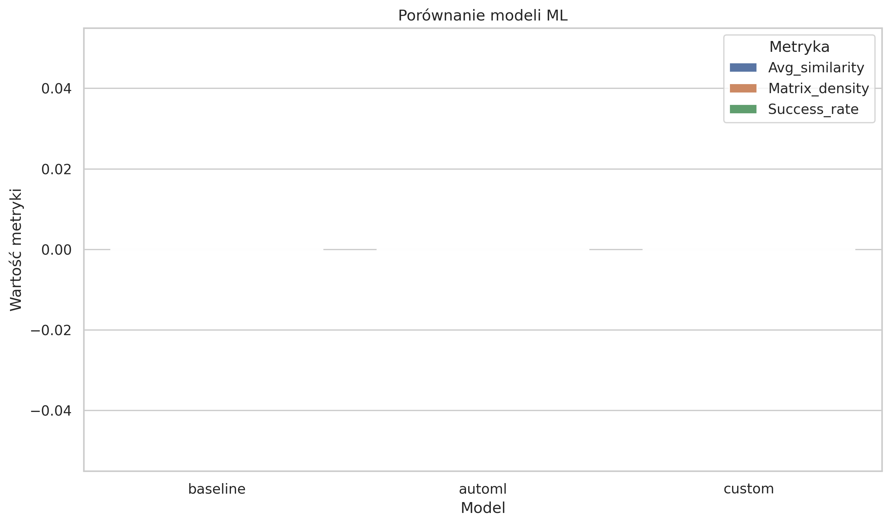
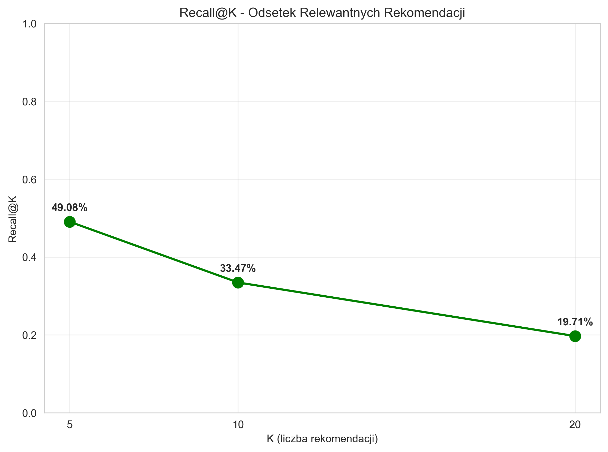
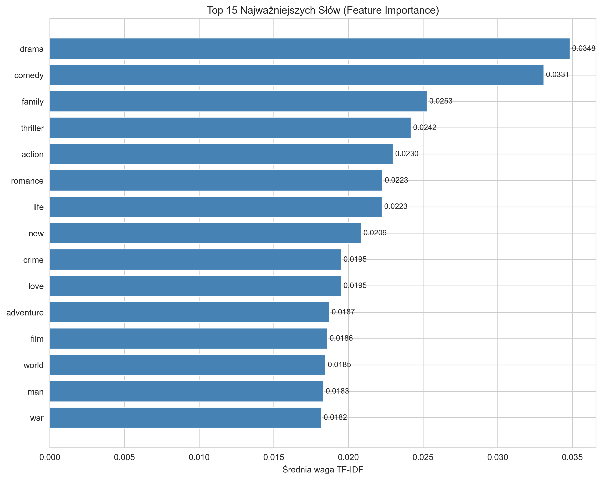
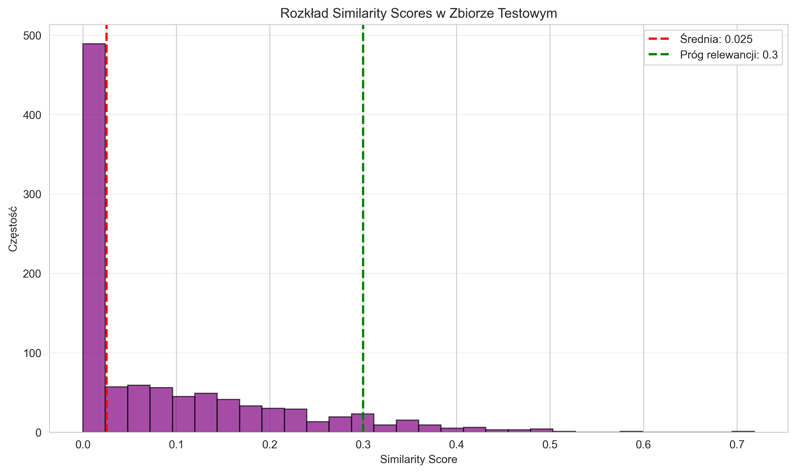
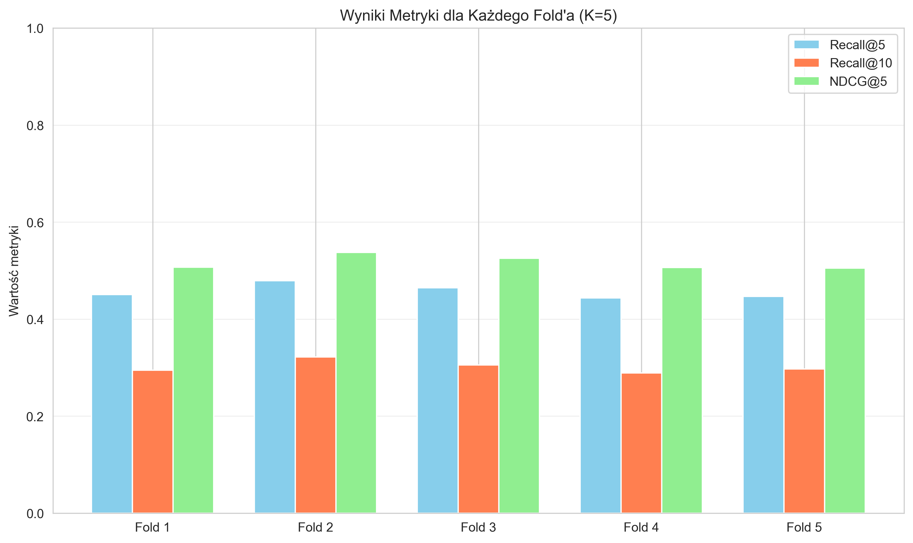

# Raport Ewaluacji Modelu — Zajęcia 5

**Data:** 2025-11-26
**Model:** baseline_tfidf_cosine_similarity (wersja: baseline_v1.0)

## 1. Podsumowanie
Projekt korzysta z podejścia content-based (TF-IDF + cosine similarity) do rekomendacji filmów.
Ewaluacja obejmuje walidację krzyżową (K=5) oraz ocenę na zbiorze testowym. Zapisane metryki znajdują się w `data/reporting/`.

## 2. Rozmiary zbiorów
- Train: 4080 próbek
- Test: 720 próbek

## 3. Wyniki

**Walidacja krzyżowa (średnie):**
- Recall@5: 0.457
- Recall@10: 0.302
- Recall@20: 0.173
- NDCG@5: 0.516
- NDCG@10: 0.387
- MAP@5: 0.723
- Średnie podobieństwo: 0.025

**Zestaw testowy:**
- Recall@5: 0.491
- Recall@10: 0.335
- Recall@20: 0.197
- NDCG@5: 0.548
- NDCG@10: 0.420
- MAP@5: 0.742
- Średnie podobieństwo: 0.0253

Źródła metryk: `data/reporting/cv_results.json`, `data/reporting/test_evaluation_results.json` oraz `data/reporting/model_version_record.json`.

## 4. Feature importance
Top 10 cech (słowa kluczowe) wg wag TF-IDF:

1. drama (0.03484)
2. comedy (0.03310)
3. family (0.02528)
4. thriller (0.02420)
5. action (0.02299)
6. romance (0.02230)
7. life (0.02225)
8. new (0.02086)
9. crime (0.01953)
10. love (0.01953)

Pełna lista i statystyki zapisane w `data/reporting/feature_importance_results.json`.

## 5. Wygenerowane wykresy
Wszystkie wykresy znajdują się w `data/08_reporting/plots/`:
Poniżej osadzone wykresy wygenerowane przez skrypt analityczny.

### Porównanie metryk: Cross-Validation vs Test Set

### Recall@K

### Top 15 ważnych słów (Feature Importance)

### Rozkład similarity scores (estymowany)

### Wyniki dla poszczególnych foldów (CV)

## 6. Interpretacja wyników
- Model baseline (TF-IDF + cosine) osiąga umiarkowane wyniki: Recall@5 ≈ 0.49 na zbiorze testowym.
- Wysokie wartości MAP sugerują, że top-ranki są względnie spójne.
- Średnie similarity jest niskie (~0.025), co wynika z rzadkości dopasowań w przestrzeni TF-IDF i dużej liczby możliwych dokumentów.
- Feature importance pokazuje, że metadane gatunkowe (np. `drama`, `comedy`) mają największy wpływ — wskazuje to, że model mocno polega na tagach/kluczowych słowach.

## 7. Wersjonowanie i logging
- Model zarejestrowano lokalnie w MLflow oraz zapisano rekord wersji w `data/reporting/model_versions.csv`.
- Rekord ostatniej wersji: `baseline_v1.0` (szczegóły w `data/reporting/model_version_record.json`).
