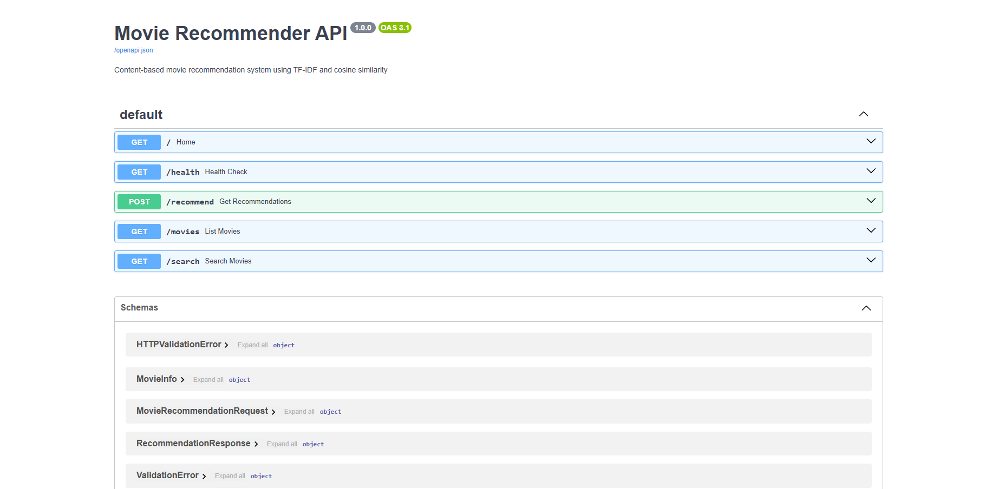
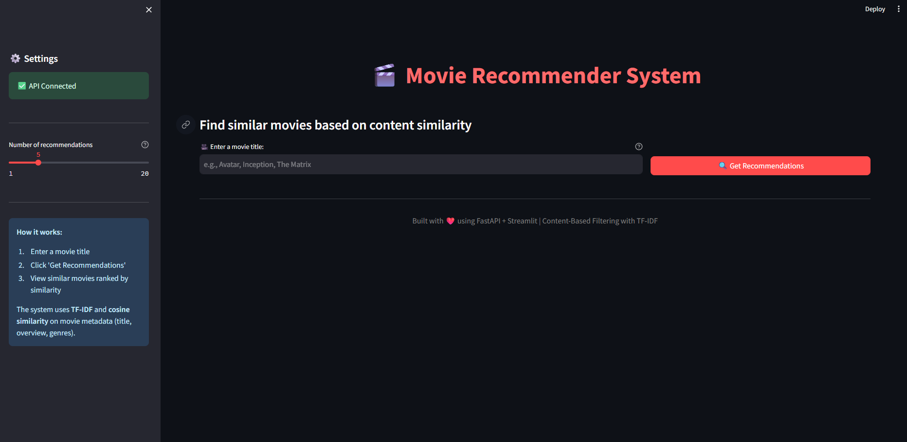
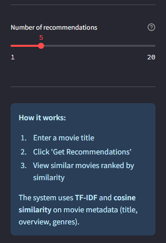
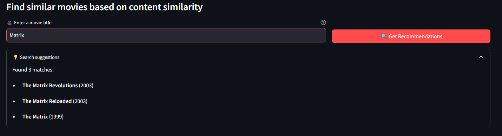
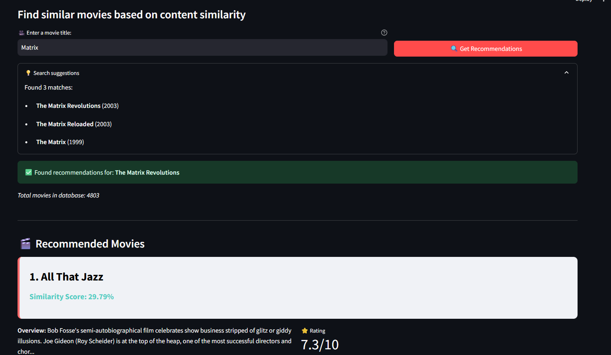
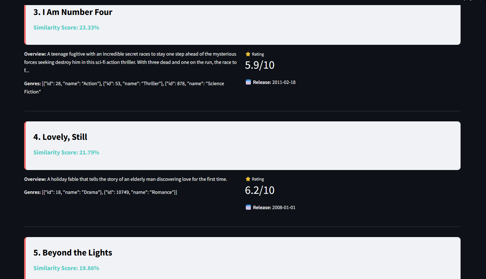
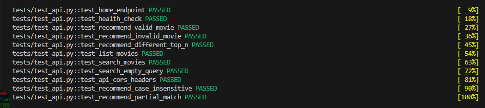

# Web Application Report - Movie Recommender System
**Projekt:** Content-Based Movie Recommender System  
**Autor:** Michał Czycza  
**Data:** 9 grudnia 2025  
**Zajęcia:** Zajęcia 7 - Budowa aplikacji backendowej i frontendowej

---

## 1. Architektura Aplikacji

### 1.1 Ogólny Przegląd

Aplikacja składa się z trzech głównych komponentów:

```
┌─────────────────┐         ┌─────────────────┐         ┌─────────────────┐
│   Frontend      │         │   Backend API   │         │   ML Model      │
│   (Streamlit)   │  HTTP   │   (FastAPI)     │  Load   │   (TF-IDF +     │
│   Port: 8501    │ ◄─────► │   Port: 8000    │ ◄─────► │   Cosine Sim)   │
└─────────────────┘         └─────────────────┘         └─────────────────┘
```

### 1.2 Backend API (FastAPI)

**Lokalizacja:** `app/main.py`

**Funkcjonalności:**
- **Wczytywanie modelu:** Automatyczne wczytywanie wytrenowanego modelu (`best_model.pkl`) i danych filmów przy starcie
- **RESTful API:** Endpointy zgodne z REST do komunikacji z frontendem
- **Predykcja w czasie rzeczywistym:** Obliczanie podobieństwa filmów na żądanie
- **Walidacja danych:** Wykorzystanie Pydantic do walidacji zapytań

**Główne endpointy:**

| Endpoint | Metoda | Opis |
|----------|--------|------|
| `/` | GET | Health check, informacje o API |
| `/health` | GET | Szczegółowy status API i modelu |
| `/recommend` | POST | Zwraca rekomendacje dla podanego filmu |
| `/movies` | GET | Lista wszystkich filmów (z paginacją) |
| `/search` | GET | Wyszukiwanie filmów po tytule |
| `/docs` | GET | Automatyczna dokumentacja Swagger UI |

### 1.3 Frontend (Streamlit)

**Lokalizacja:** `frontend/app.py`

**Funkcjonalności:**
- **Interaktywny interfejs użytkownika:** Prosty w obsłudze GUI
- **Wyszukiwanie filmów:** Auto-sugestie podczas wpisywania
- **Wyświetlanie rekomendacji:** Wizualizacja podobnych filmów z metadanymi
- **Konfiguracja:** Slider do wyboru liczby rekomendacji (1-20)
- **Status monitoring:** Sprawdzanie połączenia z API

**Elementy UI:**
- Input tekstowy dla tytułu filmu
- Slider do wyboru liczby rekomendacji
- Karty filmów z:
  - Tytułem
  - Wynikiem podobieństwa (similarity score)
  - Opisem (overview)
  - Gatunkami (genres)
  - Oceną (vote_average)
  - Datą premiery
---

## 2. Instrukcja Uruchomienia Aplikacji

### 2.1 Wymagania Wstępne

```powershell
python --version

pip install -r requirements.txt
```

### 2.2 Uruchomienie Backendu (API)



**Krok 1: Sprawdź czy model istnieje**
```powershell
ls data/reporting/best_model.pkl
```

**Krok 2: Uruchom serwer FastAPI**
```powershell
uvicorn app.main:app --reload

uvicorn app.main:app --host 0.0.0.0 --port 8000 --reload
```

**Krok 3: Sprawdź czy API działa**
- Otwórz przeglądarkę: http://localhost:8000
- Dokumentacja Swagger: http://localhost:8000/docs
- Health check: http://localhost:8000/health

**Oczekiwany output:**
```json
{
  "message": "Movie Recommender API is running 🎬",
  "status": "healthy",
  "version": "1.0.0"
}
```

### 2.3 Uruchomienie Frontendu (Streamlit)

**Krok 1: Nowy terminal (backend musi działać)**

**Krok 2: Uruchom Streamlit**
```powershell
streamlit run frontend/app.py
```

**Krok 3: Otwórz aplikację**
- Automatycznie otworzy się przeglądarka: http://localhost:8501
- Lub wprowadź URL ręcznie

### 2.4 Porty

- **Backend API:** `http://localhost:8000`
- **Frontend UI:** `http://localhost:8501`

⚠️ **Ważne:** Backend musi być uruchomiony PRZED frontendem!

---

## 3. Przykładowe Zapytania i Odpowiedzi

### 3.1 Przykład 1: Rekomendacje dla filmu "Avatar"

**Zapytanie (POST /recommend):**
```json
{
  "movie_title": "Avatar",
  "top_n": 5
}
```

**Odpowiedź:**
```json
{
  "query_movie": "Avatar",
  "recommendations": [
    {
      "title": "Guardians of the Galaxy",
      "similarity_score": 0.3456,
      "overview": "Light years from Earth...",
      "genres": "[{\"id\": 28, \"name\": \"Action\"}...]",
      "vote_average": 7.9,
      "release_date": "2014-07-30"
    },
    {
      "title": "Star Trek Into Darkness",
      "similarity_score": 0.3201,
      "overview": "When the crew of the Enterprise...",
      "genres": "[{\"id\": 28, \"name\": \"Action\"}...]",
      "vote_average": 7.4,
      "release_date": "2013-05-05"
    }
    // ... 3 więcej filmów
  ],
  "total_movies_in_db": 4803
}
```

### 3.2 Przykład 2: Wyszukiwanie filmów

**Zapytanie (GET /search?q=Inception&limit=3):**

**Odpowiedź:**
```json
{
  "query": "Inception",
  "count": 1,
  "results": [
    {
      "title": "Inception",
      "overview": "Cobb, a skilled thief...",
      "vote_average": 8.3,
      "release_date": "2010-07-15"
    }
  ]
}
```

### 3.3 Przykład 3: Lista filmów z paginacją

**Zapytanie (GET /movies?limit=2&offset=0):**

**Odpowiedź:**
```json
{
  "total": 4803,
  "limit": 2,
  "offset": 0,
  "movies": [
    {
      "title": "Avatar",
      "overview": "In the 22nd century...",
      "genres": "[{\"id\": 28, \"name\": \"Action\"}...]",
      "vote_average": 7.2,
      "release_date": "2009-12-10"
    },
    {
      "title": "Pirates of the Caribbean: At World's End",
      "overview": "Captain Barbossa, long believed...",
      "genres": "[{\"id\": 12, \"name\": \"Adventure\"}...]",
      "vote_average": 6.9,
      "release_date": "2007-05-19"
    }
  ]
}
```

---

## 4. Zrzuty Ekranu







---

## 5. Testy Integracyjne

### 5.1 Wyniki Testów



**Pokrycie testowe:**
- ✅ `test_home_endpoint` - Sprawdzenie endpointu głównego
- ✅ `test_health_check` - Weryfikacja statusu API i modelu
- ✅ `test_recommend_valid_movie` - Rekomendacje dla istniejącego filmu
- ✅ `test_recommend_invalid_movie` - Obsługa nieistniejącego filmu (404)
- ✅ `test_recommend_different_top_n` - Parametryzacja liczby rekomendacji
- ✅ `test_list_movies` - Paginacja listy filmów
- ✅ `test_search_movies` - Wyszukiwanie po tytule
- ✅ `test_search_empty_query` - Obsługa pustych zapytań
- ✅ `test_api_cors_headers` - Weryfikacja nagłówków CORS
- ✅ `test_recommend_case_insensitive` - Niewrażliwość na wielkość liter
- ✅ `test_recommend_partial_match` - Częściowe dopasowanie tytułów

